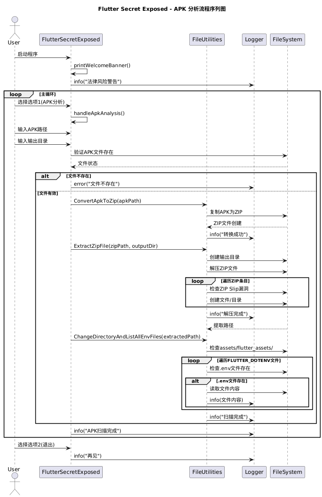
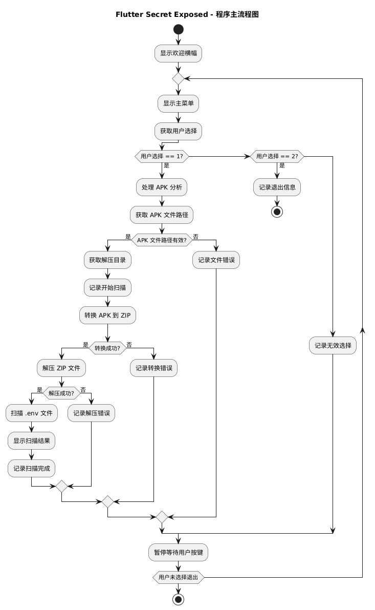
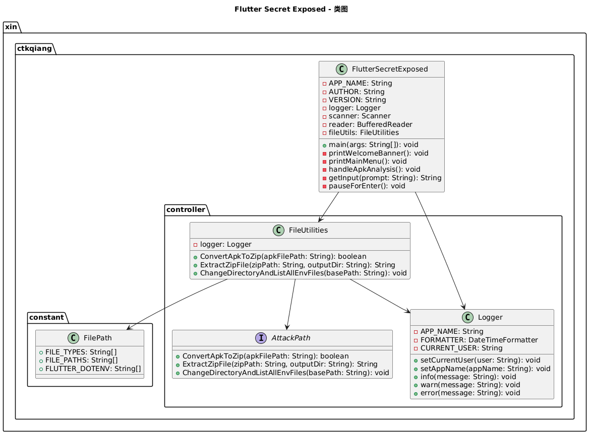

# Flutter Secret Exposed

## 简介

`Flutter Secret Exposed` 是一个用于分析 Flutter APK 文件，并从中提取潜在敏感环境变量配置的工具。本工具旨在帮助开发者和安全研究人员识别和审计其应用程序中可能意外暴露的秘密信息，从而提高应用程序的安全性。

**请注意：本工具仅供教育研究和技术学习使用，严禁用于非法入侵、数据窃取等违法行为。违反相关法律法规将承担法律责任。使用前请确保已获得合法授权。开发者不承担用户滥用导致的任何责任。**

## 功能特性

*   **APK 文件转换与解压**：能够将 `.apk` 文件转换为 `.zip` 格式并进行解压，以便访问其内部文件结构。
*   **`.env` 文件扫描**：自动在解压后的 Flutter 项目资产中查找常见的 `.env` 配置文件（如 `.env`, `.env.dev`, `.env.production` 等）。
*   **敏感信息展示**：一旦找到 `.env` 文件，将直接打印其内容，帮助用户快速审查潜在的敏感配置。
*   **用户友好的命令行界面**：提供简洁的交互式菜单，引导用户完成操作。

## 构建与运行

### 环境要求

*   Java Development Kit (JDK) 17 或更高版本
*   Maven

### 构建项目

在项目根目录下执行以下 Maven 命令进行构建：

```bash
mvn clean install
```

这将在 `target/` 目录下生成一个可执行的 JAR 文件，例如 `flutter_secret_exposed-1.0-SNAPSHOT.jar`。

### 运行项目

构建成功后，可以通过以下命令运行程序：

```bash
java -jar target/flutter_secret_exposed-1.0-SNAPSHOT.jar
```

## 使用方法

1.  **启动程序**：运行上述命令启动 `Flutter Secret Exposed`。
2.  **选择操作**：在主菜单中，选择 `1. 扫描 APK 文件中的 .env 配置`。
3.  **输入 APK 路径**：程序会提示你输入要分析的 APK 文件的完整路径。
4.  **输入解压目录**：你可以选择一个目录来解压 APK 文件。如果留空，将默认解压到当前目录下的 `extracted` 文件夹。
5.  **查看结果**：程序将自动进行 APK 转换、解压，并在 `assets/flutter_assets/` 目录下查找 `.env` 文件。如果找到，其内容将直接显示在控制台中。

### 运行示例

下面是一次真实的运行日志，展示了对某个 APK 文件的分析过程（敏感信息已做脱敏处理）：

```bash
ctkqiang | Flutter 秘密暴露 [info] | 2025-11-08 23:05:06 | ┌────────────────────────────────────────────────────────────── 
ctkqiang | Flutter 秘密暴露 [info] | 2025-11-08 23:05:06 | │                 Flutter 秘密暴露 (1.0.0)           
ctkqiang | Flutter 秘密暴露 [info] | 2025-11-08 23:05:06 | │                 作者: 钟智强                       
ctkqiang | Flutter 秘密暴露 [info] | 2025-11-08 23:05:06 | └────────────────────────────────────────────────────────────── 
...
📁 请输入 APK 文件路径: '/Users/ctkqiang/Dxxxxxxxxx/xxxx-xxxxxxxxxx.apk' 
📂 请输入解压目录 [默认: ./extracted]: 
ctkqiang | Flutter 秘密暴露 [info] | 2025-11-08 23:05:21 | 🚀 开始扫描 APK 文件...
...
ctkqiang | Flutter 秘密暴露 [info] | 2025-11-08 23:05:23 | ================================================== 
ctkqiang | Flutter 秘密暴露 [info] | 2025-11-08 23:05:23 | .env.dev 
ctkqiang | Flutter 秘密暴露 [info] | 2025-11-08 23:05:23 | ================================================== 
ctkqiang | Flutter 秘密暴露 [info] | 2025-11-08 23:05:23 | ENVIRONMENT=develop 
ctkqiang | Flutter 秘密暴露 [info] | 2025-11-08 23:05:23 | ENV_TYPE=D 
ctkqiang | Flutter 秘密暴露 [info] | 2025-11-08 23:05:23 | APP_NAME="xxxx xxxx xxxx" 
ctkqiang | Flutter 秘密暴露 [info] | 2025-11-08 23:05:23 | BASE_URL=xxxxxxxxxx 
ctkqiang | Flutter 秘密暴露 [info] | 2025-11-08 23:05:23 | API_URL_MY=$BASE_URL.com 
ctkqiang | Flutter 秘密暴露 [info] | 2025-11-08 23:05:23 | APPIER_IS_SANDBOX=true 
ctkqiang | Flutter 秘密暴露 [info] | 2025-11-08 23:05:23 | 
...
```

**注意**：日志中的敏感信息（如域名、App ID 等）已用 `xxxx` 进行脱敏处理，实际运行时会显示真实内容。

## 项目结构概览

```powershell
.
├── .gitignore
├── pom.xml
├── src/
│   └── main/
│       └── java/
│           └── xin/
│               └── ctkqiang/
│                   ├── constant/
│                   │   └── FilePath.java
│                   ├── controller/
│                   │   ├── FileUtilities.java
│                   │   ├── Logger.java
│                   │   └── interfaces/
│                   │       └── AttackPath.java
│                   └── FlutterSecretExposed.java
└── docs/
    ├── class_diagram.puml
    ├── flow_diagram.puml
    └── sequence_diagram.puml
```


## 架构





## 法律风险警告

*   本软件仅供教育研究和技术学习使用。
*   严禁用于非法入侵、数据窃取等违法行为。
*   违反《网络安全法》《刑法》将承担法律责任。
*   使用前请确保已获得合法授权。
*   开发者不承担用户滥用导致的任何责任。

## 作者

钟智强 

## 版本

1.0.0


## 🫶 Star 一下让我知道你看见我啦！

这不仅是个工具，也是我热爱的安全世界的一部分 ❤️

## 🧪 未来计划

- [ ] 支持 Gradle 与 Kotlin DSL（`build.gradle.kts`）文件的反编译与敏感信息提取  
- [ ] 支持 `AndroidManifest.xml` 源码级反编译，并高亮展示潜在暴露的组件与权限  
- [ ] 中文界面与中文报告输出，方便国内开发者阅读与审计

---
 ## 许可证

本项目采用 **木兰宽松许可证 (Mulan PSL)** 进行许可。  

[](http://license.coscl.org.cn/MulanPSL2)

## 🌟 开源项目赞助计划

### 用捐赠助力发展

感谢您使用本项目！您的支持是开源持续发展的核心动力。  
每一份捐赠都将直接用于：  
✅ 服务器与基础设施维护（魔法城堡的维修费哟~）  
✅ 新功能开发与版本迭代（魔法技能树要升级哒~）  
✅ 文档优化与社区建设（魔法图书馆要扩建呀~）

点滴支持皆能汇聚成海，让我们共同打造更强大的开源工具！  
（小仙子们在向你比心哟~）

---

### 🌐 全球捐赠通道

#### 国内用户

<div align="center" style="margin: 40px 0">

<div align="center">
<table>
<tr>
<td align="center" width="300">

<br />
<strong>🔵 支付宝</strong>（小企鹅在收金币哟~）
</td>
<td align="center" width="300">

<br />
<strong>🟢 微信支付</strong>（小绿龙在收金币哟~）
</td>
</tr>
</table>
</div>
</div>

#### 国际用户

<div align="center" style="margin: 40px 0">
  <a href="https://qr.alipay.com/fkx19369scgxdrkv8mxso92" target="_blank">
    
  </a>
  
  <a href="https://ko-fi.com/F1F5VCZJU" target="_blank">
    
  </a>
  
  <a href="https://www.paypal.com/paypalme/ctkqiang" target="_blank">
    
  </a>
  
  <a href="https://donate.stripe.com/00gg2nefu6TK1LqeUY" target="_blank">
    
  </a>
</div>

---

### 📌 开发者社交图谱

#### 技术交流

<div align="center" style="margin: 20px 0">
  <a href="https://github.com/ctkqiang" target="_blank">
    
  </a>
  
  <a href="https://stackoverflow.com/users/10758321/%e9%92%9f%e6%99%ba%e5%bc%ba" target="_blank">
    
  </a>
  
  <a href="https://www.linkedin.com/in/ctkqiang/" target="_blank">
    
  </a>
</div>

#### 社交互动

<div align="center" style="margin: 20px 0">
  <a href="https://www.instagram.com/ctkqiang" target="_blank">
    
  </a>
  
  <a href="https://twitch.tv/ctkqiang" target="_blank">
    
  </a>
  
  <a href="https://github.com/ctkqiang/ctkqiang/blob/main/assets/IMG_9245.JPG?raw=true" target="_blank">
    
  </a>
</div>

---

🙌 感谢您成为开源社区的重要一员！  
💬 捐赠后欢迎通过社交平台与我联系，您的名字将出现在项目致谢列表！